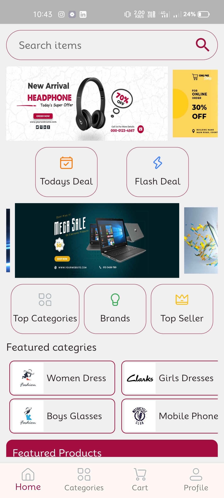

# QuickMart

# Overview
Introducing Quick Mart, an online shopping application that lets users browse products, view product descriptions, add goods to their carts, and wishlist items. and also conduct item-by-name searches, make orders, and shop for a variety of products with this fully e-commerce app.

## Key Features
  - **WishList Items:** Users are able to wishlist their favorite apps.
  - **User-Friendly Interface:** Created with an easy-to-use UI to improve user experience.
  - **Palce Order:** Order placement feature is offered.
  - **Product Category:** Products listed by their categories.
  - **Searching Products:** User can search the products by their names.
 
## Additional Features
  - **SignUp/Login:** User can effortlessly create new account or loged in with existing one.
  - **Forget Password:** Password can be reset after forgeting.
  - **Google SignUP:** User can signup with their loged in google accounts.

## Technology
  - **Flutter & Dart:** 
  - **Firebase Services:** Authentication, Cloud firestore, firebase Storage.
  - **GetX:**

## Screenshots
<div style=align-items: center;>
  
  
  
  
  
  
  
</div>

## Installation Process

1. **Clone the Repository**
   ```bash
   git clone https://github.com/Ankush1200/flutter_ecommerce

2. **Install dependencies**
   ```bash
   flutter pub get
3. **Run the app**
   ```bash
   flutter run

## Contribution
Contributions are welcome! Please fork this repository and submit a pull request for any feature enhancements or bug fixes.

## Contact
- **Email**: ankush78607@gmail.com.
- **GitHub**: https://github.com/Ankush1200.
